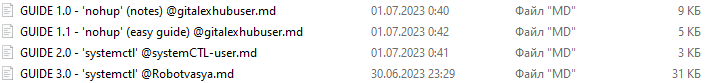

# DeployBotsWinSCP

## Описание
Недавно в [телеграм чате](https://t.me/+c8r_IMXAMjpkZTY6) посвященному LXD VPS хостингу - проходил конкурс на написание лучшего (~~понятного~~) гайда по **деплою Telegram ботов** на этот самый хостинг!

> Деплой (deploy) — это запуск вашего веб-приложения, сайта или телеграмм бота, на удалённом сервере или хостинге.

На данный момент - конкурс уже завершен!

В [данном репозитории](https://github.com/gitalexhubuser/DeployBotsWinSCP) - собраны работы всех участников.

---

## Лучший выбор для новичка

На мой скромный взгляд - лучшим гайдом для новичка является [GUIDE 1.1 - 'nohup' (easy guide) @gitalexhubuser](https://github.com/gitalexhubuser/DeployBotsWinSCP/blob/main/GUIDE%201.1%20-%20'nohup'%20(easy%20guide)%20%40gitalexhubuser.md)
> Там есть картинки, и данный метод - очень быстро можно воспроизвести самостоятельно! Если вам нужно просто тупо запустить бота и протестить, что всё работает.

Если вы готовы пойти дальше, и вам нужен такой бот, которому не страшны падения и перезагрузки - то лучше изучить, как это делается при помощи другой технологии:

- [ ] `systemctl` 
- [ ] а не ~~nohup~~

о которой более подробно рассказано в этих гайдах:

- [GUIDE 2.0 - 'systemctl' @systemCTL-user](https://github.com/gitalexhubuser/DeployBotsWinSCP/blob/main/GUIDE%201.1%20-%20'nohup'%20(easy%20guide)%20%40gitalexhubuser.md)

- [GUIDE 3.0 - 'systemctl' @Robotvasya](https://github.com/gitalexhubuser/DeployBotsWinSCP/blob/main/GUIDE%201.1%20-%20'nohup'%20(easy%20guide)%20%40gitalexhubuser.md)

---

## Список ВСЕХ гайдов:

4 шт

- [GUIDE 1.0 - 'nohup' (notes) @gitalexhubuser](https://github.com/gitalexhubuser/DeployBotsWinSCP/blob/main/GUIDE%201.0%20-%20'nohup'%20(notes)%20%40gitalexhubuser.md)

- [GUIDE 1.1 - 'nohup' (easy guide) @gitalexhubuser](https://github.com/gitalexhubuser/DeployBotsWinSCP/blob/main/GUIDE%201.1%20-%20'nohup'%20(easy%20guide)%20%40gitalexhubuser.md)

- [GUIDE 2.0 - 'systemctl' @systemCTL-user](https://github.com/gitalexhubuser/DeployBotsWinSCP/blob/main/GUIDE%201.1%20-%20'nohup'%20(easy%20guide)%20%40gitalexhubuser.md)

- [GUIDE 3.0 - 'systemctl' @Robotvasya](https://github.com/gitalexhubuser/DeployBotsWinSCP/blob/main/GUIDE%201.1%20-%20'nohup'%20(easy%20guide)%20%40gitalexhubuser.md)

> Вы так же можете написать свой гайд - [отправить его мне](https://t.me/alexdubovyckvideos) - и я его добавлю в общий список!

---

# Ссылки
| Описание | Ссылка |
| ------ | ------ |
Чат VPS хостинга: | [t.me/+c8r_IMXAMjpkZTY6](https://t.me/+c8r_IMXAMjpkZTY6)
Бесплатный хостинг (пишите в личку Леониду): | [t.me/Lvikme](https://t.me/Lvikme)
Репо: | [github.com/gitalexhubuser/DeployBotsWinSCP](https://github.com/gitalexhubuser/DeployBotsWinSCP)
